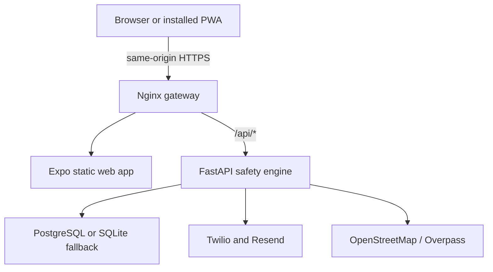

<div align="center">
  

  # Shakti360 Guardian

  **Personal safety without permanent surveillance.**

  A privacy-first, battery-aware safety platform built for women and anyone who wants safer journeys, trusted human support, practical digital-safety tools, and control over what is shared.

  [](https://shakti360-guardian-production.up.railway.app/)
  [](https://shakti360-guardian.netlify.app/)
  [](https://devfolio.co/projects/shaktiguardian-6a62)

  
  
  
  
  
</div>

## Try the working product

| Experience | Link |
|---|---|
| Primary production app | [Open Shakti360 on Railway](https://shakti360-guardian-production.up.railway.app/) |
| Netlify deployment | [Open Shakti360 on Netlify](https://shakti360-guardian.netlify.app/) |
| Interactive API documentation | [Open FastAPI Swagger UI](https://shakti360-guardian-production.up.railway.app/api/docs) |
| Health endpoint | [Check the live API](https://shakti360-guardian-production.up.railway.app/api/health) |
| Hackathon submission | [View Shakti Guardian on Devfolio](https://devfolio.co/projects/shaktiguardian-6a62) |

The web experience is an installable Progressive Web App. On iPhone or iPad, open it in Safari and use **Share → Add to Home Screen**. Apple does not allow a website to open that installation dialog automatically.

## The problem

Personal-safety tools often force users into an uncomfortable tradeoff: accept continuous tracking or lose protection. They may also hide delivery failures, drain the battery through constant GPS polling, or imply that an automated system can guarantee safety.

People need a tool that:

- protects them during a specific journey without tracking them forever;
- keeps trusted people informed without taking control away from the user;
- responds predictably when a check-in is missed;
- stays useful when battery, network, or notification providers are limited;
- helps with physical safety, digital threats, evidence, and nearby support in one place; and
- communicates uncertainty honestly.

## The solution

Shakti360 creates a temporary safety session around a journey. The user chooses the destination, ETA, battery level, and Guardian Circle. During the journey, the system applies a deterministic escalation policy, adapts its power strategy, supports quick check-ins and SafeWord activation, and ends temporary monitoring when the user arrives safely.

The same product also provides scam-message analysis, private incident documentation, privacy receipts, readiness checks, pattern insights, and nearby support resources.

## What makes Shakti360 different

- **Purpose-bound protection:** monitoring is attached to a journey and ends with it.
- **Human-controlled escalation:** the application presents options; it never silently contacts emergency services.
- **Battery-aware design:** native builds can sync battery changes automatically. Browsers that block battery access, including iPhone Safari, show an honest manual field instead of a fabricated value.
- **Editable active journeys:** ETA and battery can be corrected even after a journey starts.
- **Editable Guardian Circle:** existing guardian names, phone numbers, and email addresses can be updated.
- **Truthful notifications:** Twilio and Resend adapters distinguish queued, failed, and unconfigured delivery.
- **Privacy receipts:** completed journeys create a readable record of what was shared, with whom, and for how long.
- **Resilient PWA:** the application has an offline shell, network-first route updates, and device-specific installation guidance.
- **Explainable assistance:** AI-style tools explain their reasoning without claiming to predict crime or guarantee safety.

## Product capabilities

### Journey Guardian

- Custom starting point, destination, and ETA
- Automatic battery reading where supported, with manual fallback
- Live ETA and battery editing during an active journey
- Safe-arrival check-in and missed-check-in simulation
- Deterministic escalation levels
- SafeWord workflow
- Recovery of active local journey state after refresh

### Trusted Guardian Circle

- Guardian name, relationship, phone, and email
- SMS or email invitation channels
- Editable contact details
- Per-event permissions for journey start, missed check-in, SOS, and temporary location
- Secure invitation links that expire after 24 hours
- Copy/share fallback when a delivery provider is unavailable

### Safety toolkit

- Nearby hospitals, clinics, pharmacies, and police using OpenStreetMap/Overpass
- Suspicious-message and scam analysis
- Safety-readiness assessment
- Evidence Vault with structured incident summaries
- Privacy review and locally stored privacy receipts
- Pattern insights across the user's own incident records
- Explicit SOS session with user-controlled cancellation

## Agentic safety system

| Agent or engine | Responsibility |
|---|---|
| Journey Guardian | Maintains the timed journey and check-in lifecycle |
| Battery Guardian | Selects a balanced, saver, or critical power policy |
| Context Fusion Agent | Combines journey, battery, network, and check-in signals |
| Escalation Engine | Applies transparent deterministic safety rules |
| Trusted Circle | Routes updates only to contacts selected by the user |
| Cyber Guardian | Examines suspicious messages and explains risk indicators |
| Evidence Guardian | Converts incident notes into a structured summary |
| Privacy Guardian | Identifies unnecessary permissions and exposure |
| Readiness Agent | Finds gaps in the user's current safety setup |
| Pattern Agent | Summarizes recurring themes without predicting future crime |

## Architecture



Railway builds both application layers into one container. Nginx serves the Expo export and forwards `/api/*` to FastAPI on the private loopback interface. Netlify serves the same static Expo export and proxies `/api/*` to the Railway API, preserving a simple same-origin browser contract.

## Technology stack

| Layer | Technology |
|---|---|
| Cross-platform client | Expo Router, React Native, React Native Web, TypeScript |
| Installable web app | Static Expo export, Web App Manifest, Workbox service worker |
| API | FastAPI, Pydantic, Uvicorn |
| Authentication | Argon2 password hashing, short-lived access tokens, revocable refresh sessions, HttpOnly cookies, CSRF protection |
| Data | SQLAlchemy, PostgreSQL in production, SQLite fallback for local/demo use |
| Notifications | Twilio SMS and Resend email |
| Nearby resources | OpenStreetMap and Overpass API |
| Production gateway | Nginx |
| Deployment | Railway Docker deployment and Netlify static deployment |
| Quality | Pytest, TypeScript compiler, Expo static export, GitHub Actions |

## Three-minute judge demo

1. Open the [live Railway app](https://shakti360-guardian-production.up.railway.app/) and create an account or explore the product.
2. Open **Guardians**, add a trusted contact, and demonstrate the secure invitation link.
3. Edit the guardian's phone number to show that contact information remains under user control.
4. Open **Journey**, enter a route, ETA, and the phone battery percentage if the browser cannot read it.
5. Start protection and show the expected-arrival time and Battery Guardian policy.
6. Edit the ETA during the active journey.
7. Trigger a demo missed check-in or SafeWord to show deterministic escalation.
8. Select **I arrived safely**, then open the privacy receipt.
9. Briefly show **Nearby support**, **Scam scanner**, **Evidence Vault**, and **Safety readiness**.
10. On iPhone, demonstrate **Share → Add to Home Screen**; on supported Android/desktop browsers, use the browser install prompt.

## Privacy and security by design

- No permanent background-surveillance requirement
- Temporary journey and location-sharing language throughout the product
- Secure, HttpOnly authentication cookies
- CSRF verification on authenticated mutations
- Argon2 password hashing
- Owner-scoped guardians and incident records
- Expiring Guardian Circle invitation tokens
- No-store API responses and request IDs
- Explicit status for unavailable notification providers
- Bounded timeouts for external resource providers
- No hidden or automatic emergency-services contact

## Local development

Requirements: **Python 3.12**, **Node.js 22**, and npm.

### Start the API

```bash
cd backend
python -m venv .venv
source .venv/bin/activate  # Windows PowerShell: .\.venv\Scripts\Activate.ps1
python -m pip install -r requirements.txt
python -m uvicorn app.main:app --reload --port 8000
```

API documentation will be available at `http://127.0.0.1:8000/docs`.

### Start the Expo client

```bash
cd app
npm ci
EXPO_PUBLIC_API_URL=http://127.0.0.1:8000 npx expo start
```

For a physical phone on the same Wi-Fi network, replace `127.0.0.1` with the computer's LAN address.

### Run with Docker Compose

```bash
docker compose up --build
```

The web app will be available at `http://localhost:8080` and the API at `http://localhost:8000`.

## Verification

```bash
cd backend
python -m pytest -q

cd ../app
npm run typecheck
npm run build:web
```

Current verified result:

```text
71 backend tests passing
23 Expo static routes exported
Frontend TypeScript passing
Production PWA export passing
Railway deployment healthy
Netlify deployment healthy
```

## Deployment

### Railway: full-stack production

The root [`Dockerfile`](./Dockerfile) builds the Expo client, installs the FastAPI backend, and exposes Nginx on Railway's dynamic port. [`railway.json`](./railway.json) contains the repository deployment configuration.

Required production variables:

```env
APP_ENV=production
JWT_SECRET=<long-random-secret>
GUARDIAN_INVITE_BASE_URL=https://shakti360-guardian-production.up.railway.app/guardian-invite
DATABASE_URL=<railway-postgresql-reference>
```

Optional real-notification variables:

```env
TWILIO_ACCOUNT_SID=ACxxxxxxxxxxxxxxxx
TWILIO_AUTH_TOKEN=xxxxxxxxxxxxxxxx
TWILIO_FROM_NUMBER=+15551234567
RESEND_API_KEY=re_xxxxxxxxxxxxxxxx
RESEND_FROM_EMAIL=Shakti360 Guardian <alerts@your-verified-domain.com>
```

### Netlify: static PWA

The root [`netlify.toml`](./netlify.toml) configures:

```text
Base directory: app
Build command: npm run build:web
Publish directory: app/dist
```

It also disables the stale Next.js runtime and proxies `/api/*` to the Railway backend. This repository is an Expo application, not a Next.js application.

## API map

| Capability | Endpoints |
|---|---|
| Authentication | `/auth/register`, `/auth/login`, `/auth/me`, `/auth/refresh`, `/auth/logout` |
| Journeys | `/journeys`, `/journeys/{id}`, `/journeys/{id}/update`, `/journeys/checkin`, `/journeys/safeword`, `/journeys/{id}/sos` |
| Guardian Circle | `/guardians`, `/guardians/{id}/update`, `/guardians/{id}/send-invite`, `/guardian-invites/{token}`, `/guardians/notify` |
| SOS | `/sos`, `/sos/{id}/cancel` |
| Nearby support | `/resources/nearby`, `/resources/nearby-v2` |
| Safety agents | `/agents/cyber`, `/agents/privacy`, `/agents/context`, `/readiness`, `/battery/policy` |
| Evidence and impact | `/incidents`, `/incidents/patterns`, `/feedback`, `/analytics/impact` |
| Operations | `/health`, `/ready`, `/notifications/status`, `/docs` |

Prefix API routes with `/api` in production, for example `/api/auth/login`.

## Safety boundaries

Shakti360 does not guarantee safety, predict crime, replace emergency services, or claim that a queued provider request was delivered or opened. Community-maintained nearby-resource data can be incomplete. Users should verify critical information independently and contact local emergency services directly when immediate help is required.

AI assists with interpretation and organization. High-impact escalation remains deterministic and human-controlled.

## Bonus: ShaktiSafe Brief

This repository also contains a standalone Rote Play for a reusable **before-I-leave** check. It compares worldwide weather, modeled air quality, and supported U.S. National Weather Service alerts against the previous successful check for the same outing.

- [Published ShaktiSafe Brief Play](https://play.modiqo.ai/harshapriyag123/shaktisafe-brief@0.1.0)
- [Hackathon submission package](./hackathon-submission/SUBMISSION.md)
- [Rote implementation](./rote/shaktisafe-brief/)

## Built with purpose

Shakti360 was created as a social-impact safety project: technology should strengthen a person's choices and trusted relationships without demanding permanent surveillance in return.

If this project resonates with you, try the live demo, share feedback, or open an issue.

<div align="center">

**AI assists. You decide.**

</div>
